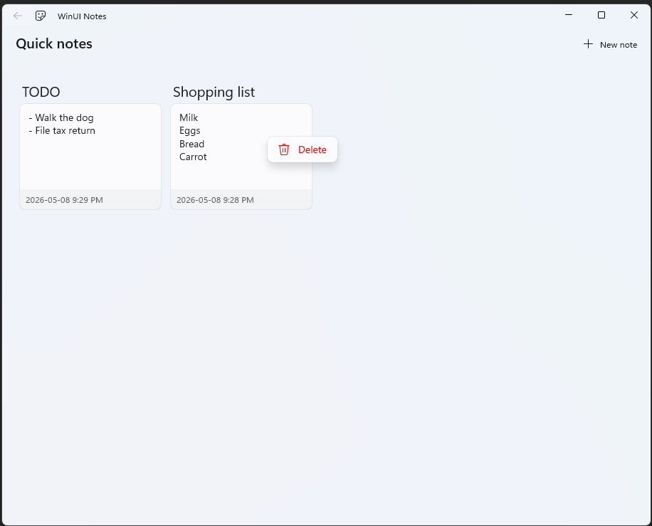

# WinUINotes (C++)

This project implements the [WinUINotes](https://learn.microsoft.com/en-us/windows/apps/tutorials/winui-notes/intro) tutorial, but in C++/WinRT.

## My modifications

- Notes are sorted in descending order by modified date.
- Each note has a title. Attempting to save a note with a blank title will display an error dialog.
- On the AllNotes page, you can right-click a note and delete it via the context menu.

## Screenshot

